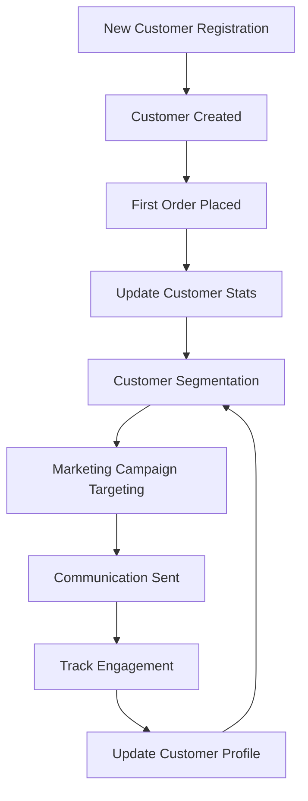
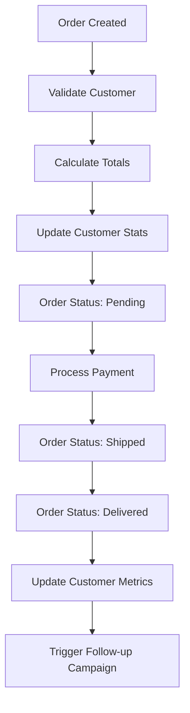
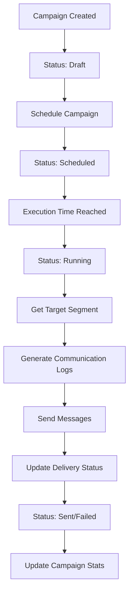
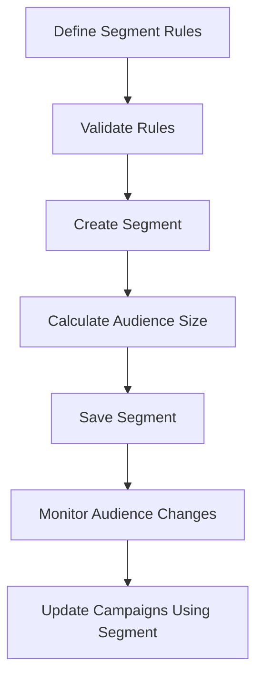
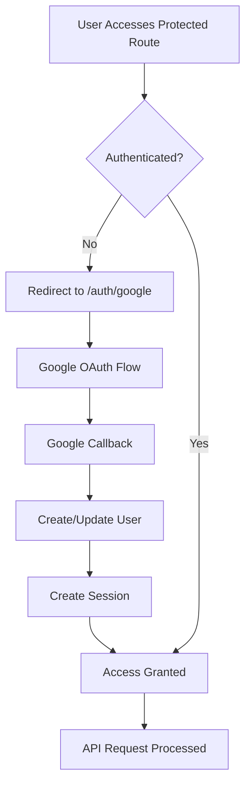
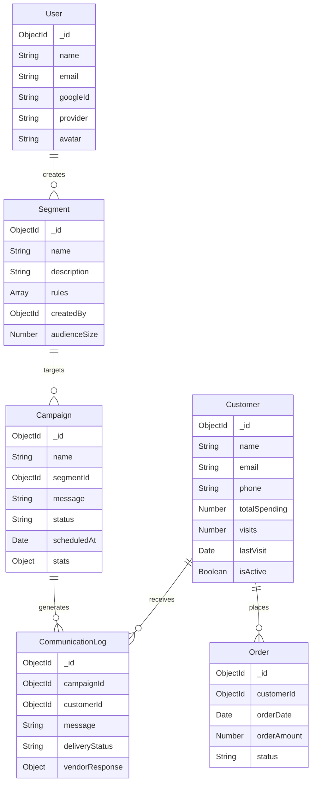

# CRM Backend - Schemas & Workflows

This document provides detailed information about data schemas, validation rules, and business workflows implemented in the CRM Backend API.

## Table of Contents

- [Data Models](#data-models)
- [Validation Schemas](#validation-schemas)
- [Business Workflows](#business-workflows)
- [Authentication Flow](#authentication-flow)
- [Data Relationships](#data-relationships)
- [API Response Formats](#api-response-formats)

## Data Models

### User Model

```javascript
{
  _id: ObjectId,
  name: String (required, trimmed),
  email: String (required, unique, lowercase),
  googleId: String (unique, sparse),
  provider: String (enum: ['google', 'local'], default: 'local'),
  avatar: String (optional),
  createdAt: Date,
  updatedAt: Date
}
```

**Fields:**

- `name`: User's full name (max 100 characters)
- `email`: Unique email address (automatically lowercased)
- `googleId`: Google OAuth identifier (allows multiple null values)
- `provider`: Authentication method used
- `avatar`: URL to user's profile picture

### Customer Model

```javascript
{
  _id: ObjectId,
  name: String (required, trimmed),
  email: String (required, unique, lowercase),
  phone: String (optional, trimmed),
  totalSpending: Number (default: 0),
  visits: Number (default: 0),
  lastVisit: Date (nullable),
  isActive: Boolean (default: true),
  createdAt: Date,
  updatedAt: Date
}
```

**Fields:**

- `name`: Customer's full name
- `email`: Customer's email address
- `phone`: Contact phone number (with regex validation)
- `totalSpending`: Total amount spent by customer
- `visits`: Number of visits/interactions
- `lastVisit`: Date of last customer interaction
- `isActive`: Customer status flag

### Order Model

```javascript
{
  _id: ObjectId,
  customerId: ObjectId (ref: 'Customer', required),
  orderDate: Date (default: Date.now),
  orderAmount: Number (required),
  status: String (enum: ['Pending', 'Shipped', 'Delivered', 'Cancelled'], default: 'Pending'),
  createdAt: Date,
  updatedAt: Date
}
```

**Fields:**

- `customerId`: Reference to Customer who placed the order
- `orderDate`: When the order was placed
- `orderAmount`: Total order value
- `status`: Current order status

### Segment Model

```javascript
{
  _id: ObjectId,
  name: String (required, trimmed),
  description: String (optional, trimmed),
  rules: [{
    field: String (required),
    operator: String (enum: ['>', '>=', '<=', '<', '=', '!=', 'contains', 'startsWith', 'endsWith', 'in_last_days']),
    value: Mixed,
    logicalOperator: String (enum: ['AND', 'OR'], default: 'AND')
  }],
  createdBy: ObjectId (ref: 'User', required),
  audienceSize: Number (default: 0),
  createdAt: Date,
  updatedAt: Date
}
```

**Fields:**

- `name`: Segment identifier
- `description`: Optional description of segment criteria
- `rules`: Array of filtering rules for customer segmentation
- `createdBy`: User who created the segment
- `audienceSize`: Number of customers matching the rules

### Campaign Model

```javascript
{
  _id: ObjectId,
  name: String (required, trimmed),
  segmentId: ObjectId (ref: 'Segment', required),
  message: String (required),
  status: String (enum: ['Draft', 'Scheduled', 'Running', 'Sent', 'Failed'], default: 'Draft'),
  scheduledAt: Date (optional),
  completedAt: Date (optional),
  stats: {
    totalAudience: Number (default: 0),
    sent: Number (default: 0),
    failed: Number (default: 0),
    pending: Number (default: 0)
  },
  createdAt: Date,
  updatedAt: Date
}
```

**Fields:**

- `name`: Campaign identifier
- `segmentId`: Target customer segment
- `message`: Content to be sent to customers
- `status`: Current campaign status
- `scheduledAt`: When campaign should be executed
- `completedAt`: When campaign finished execution
- `stats`: Campaign performance metrics

### Communication Log Model

```javascript
{
  _id: ObjectId,
  campaignId: ObjectId (ref: 'Campaign', required),
  customerId: ObjectId (ref: 'Customer', required),
  message: String (required),
  deliveryStatus: String (enum: ['PENDING', 'SENT', 'FAILED'], default: 'PENDING'),
  vendorResponse: {
    messageId: String,
    timestamp: Date,
    errorMessage: String
  },
  sentAt: Date (optional),
  deliveredAt: Date (optional),
  createdAt: Date,
  updatedAt: Date
}
```

**Fields:**

- `campaignId`: Associated campaign
- `customerId`: Target customer
- `message`: Actual message content sent
- `deliveryStatus`: Current delivery status
- `vendorResponse`: Response from messaging service provider
- `sentAt`: When message was sent
- `deliveredAt`: When message was delivered

## Validation Schemas

### Customer Validation

#### Create Customer Schema

```javascript
{
  name: string (1-100 chars, required),
  email: string (valid email, required),
  phone: string (regex: /^[\+]?[0-9\s\-\(\)]+$/, optional),
  totalSpending: number (≥0, default: 0, optional),
  visits: number (integer, ≥0, default: 0, optional),
  lastVisit: datetime (optional),
  isActive: boolean (default: true, optional)
}
```

#### Update Customer Schema

- All fields from create schema but optional
- Same validation rules apply when fields are provided

### Order Validation

#### Create Order Schema

```javascript
{
  customerId: string (MongoDB ObjectId format, required),
  orderDate: datetime (optional, defaults to now),
  orderAmount: number (>0, required),
  status: string (enum: ['Pending', 'Shipped', 'Delivered', 'Cancelled'], optional)
}
```

#### Update Order Schema

- All fields optional except validation rules remain

### Segment Validation

#### Create Segment Schema

```javascript
{
  name: string (1-100 chars, required),
  description: string (max 500 chars, optional),
  rules: array (required, min 1 rule) [{
    field: string (required),
    operator: string (enum: ['>', '>=', '<=', '<', '=', '!=', 'contains', 'startsWith', 'endsWith', 'in_last_days']),
    value: any (required),
    logicalOperator: string (enum: ['AND', 'OR'], optional)
  }]
}
```

### Campaign Validation

#### Create Campaign Schema

```javascript
{
  name: string (1-100 chars, required),
  segmentId: string (MongoDB ObjectId, required),
  message: string (1-1000 chars, required),
  status: string (enum: ['Draft', 'Scheduled', 'Running', 'Sent', 'Failed'], optional),
  scheduledAt: datetime (optional)
}
```

## Business Workflows

### Customer Lifecycle Workflow



#### Steps

1. **Customer Registration**: New customer data is validated and stored
2. **Profile Updates**: Customer information is automatically updated based on interactions
3. **Segmentation**: Customers are automatically categorized based on defined rules
4. **Campaign Targeting**: Relevant campaigns are triggered for customer segments
5. **Communication Tracking**: All communications are logged and tracked

### Order Processing Workflow



#### States

- **Pending**: Order received and being processed
- **Shipped**: Order dispatched to customer
- **Delivered**: Order received by customer
- **Cancelled**: Order cancelled before shipment

### Campaign Execution Workflow



#### Campaign States

- **Draft**: Campaign being prepared
- **Scheduled**: Campaign scheduled for future execution
- **Running**: Campaign currently being executed
- **Sent**: Campaign successfully completed
- **Failed**: Campaign execution failed

### Segmentation Workflow



#### Rule Operators

- **Comparison**: `>`, `>=`, `<=`, `<`, `=`, `!=`
- **String Matching**: `contains`, `startsWith`, `endsWith`
- **Date Logic**: `in_last_days`
- **Logical Operators**: `AND`, `OR`

## Authentication Flow



### Session Management

- **Session Storage**: Server-side sessions with secure cookies
- **Session Duration**: 24 hours
- **Security**: HTTP-only, secure cookies in production

## Data Relationships



## API Response Formats

### Success Response Format

```javascript
{
  success: true,
  message: "Operation completed successfully",
  data: {
    // Response data object or array
  },
  meta: {
    // Optional metadata (pagination, counts, etc.)
    total: number,
    page: number,
    limit: number
  }
}
```

### Error Response Format

```javascript
{
  success: false,
  message: "Error description",
  error: {
    code: "ERROR_CODE",
    details: "Detailed error information"
  }
}
```

### Validation Error Format

```javascript
{
  success: false,
  message: "Validation failed",
  errors: [
    {
      field: "fieldName",
      message: "Validation error message"
    }
  ]
}
```

### Authentication Error Format

```javascript
{
  success: false,
  message: "Authentication required. Please log in to access this resource.",
  redirectUrl: "/auth/google"
}
```

## Status Codes

| Code | Meaning | Usage |
|------|---------|-------|
| 200 | OK | Successful GET, PUT requests |
| 201 | Created | Successful POST requests |
| 400 | Bad Request | Validation errors, malformed requests |
| 401 | Unauthorized | Authentication required |
| 403 | Forbidden | Access denied |
| 404 | Not Found | Resource not found |
| 409 | Conflict | Duplicate data, constraint violations |
| 500 | Internal Server Error | Server errors |

## Best Practices

### Data Validation

- All input data is validated using Zod schemas
- Email addresses are automatically lowercased
- Strings are trimmed to remove whitespace
- Numbers are validated for proper ranges
- Dates are validated for proper format

### Error Handling

- Consistent error response format across all endpoints
- Detailed validation error messages
- Proper HTTP status codes
- Security-conscious error messages (no sensitive data exposure)

### Security

- All business endpoints require authentication
- Session-based authentication with secure cookies
- Input validation and sanitization
- MongoDB injection prevention through Mongoose

### Performance

- Database indexes on frequently queried fields
- Pagination for large result sets
- Efficient query patterns
- Minimal data transfer in responses
